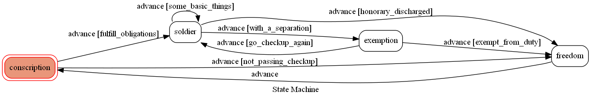

# TOC-chatbot

A chatbot based on LINE using a finite-state-machine. 

Since it is an obligation for men to have a military service, I want to share what I have seen last summer.
I wish the bot could be a good advice for those who are going to serve in the military, but I have another two months next summer, so it still has some space to make a progress after experiencing more.



## States
### conscription(役男)
The initial state is set to `conscription`.

### soldier(當兵)
The state of being a soldier. You can input some keywords here, for example

	* Input: "...掃地..."
		* Reply: "每天除了掃地、掃地，還是掃地"
		
	* Input: "...起床..."
		* Reply: "現在時間洞六洞洞，部隊起床"
		
	* Input: "...軍歌..."
		* Reply: "風雲起，山河動，黃埔建軍聲勢雄"

### exemption(驗退)
Whenever entering on this state, the bot will send *計画通り* to the user.

### freedom(自由)
The final state of the fsm, and it will advance to `conscription` again whenever users sending text message.

In every states if the bot doesn't know the input message, it will reply `你在工蝦餃`

## Setup
### Prerequisite
* Python 3.6
* Line App and Developers
* HTTPS Server
* pygraphviz/graphviz(For visualizing FSM)


#### Install Dependency
```sh
pip3 install -r requirements.txt
```


#### Secret Data
A `.env` file is needed to store `LINE_CHANNEL_SECRET` and `LINE_CHANNEL_ACCESS_TOKEN`.

You should issue these on LINE Developers, and **MUST** copy and paste them to `.env` correctly.


# 
## Deployment
Connect to Heroku in order to deploy.

### Heroku CLI installation

* [macOS, Windows](https://devcenter.heroku.com/articles/heroku-cli)


### Upload project to Heroku

1. Add local project to Heroku project

	```
	heroku git:remote -a {HEROKU_APP_NAME}
	```

2. Upload project

	```
	git add .
	git commit -m "Add code"
	git push -f heroku master
	```

3. Set Environment - Line Messaging API Secret Keys

	```
	heroku config:set LINE_CHANNEL_SECRET=your_line_channel_secret
	heroku config:set LINE_CHANNEL_ACCESS_TOKEN=your_line_channel_access_token
	```
	
	Or you can go to setting to set Config Vars on HEROKU.

4. Your Project is now running on Heroku!

	```
	url: `{HEROKU_APP_NAME}.herokuapp.com/callback`
	debug command: `heroku logs --tail --app {HEROKU_APP_NAME}`
	```

5. Dealing with `pygraphviz` install errors

	```
	heroku buildpacks:set heroku/python
	heroku buildpacks:add --index 1 heroku-community/apt
	```

# 
#### Run Locally
You can either setup https server or using `ngrok` as a proxy.


#### Ngrok
* [ macOS, Windows, Linux](https://ngrok.com/download)

**`ngrok` would be used in the following instruction**

```sh
ngrok http 8000
```

After that, `ngrok` would generate a https URL.	(*eg. https://464ac8bf.ngrok.io*)

Paste the https URL to the webhook URL on LINE Developers.

**You can add one of these in the end to check the functions.**

> /callback	-> Echo every text messages you send

> /webhook	-> Check the functionality of states

> /show-fsm	-> Download the diagram of FSM or receive the image on LINE


#### Run the server

```sh
python3 app.py
```

Now the app is running on localhost, we can check the webhook events.

By using ngrok, we can debug and check the status easily and conveniently.
